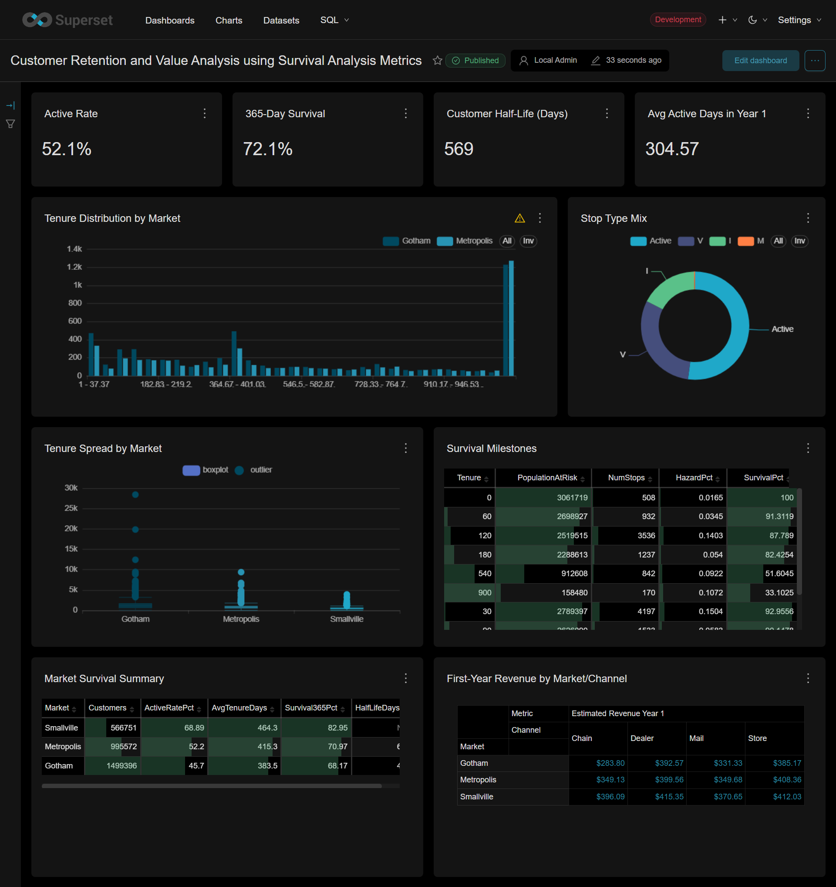

# Customer Retention and Value Analysis Using Survival Analysis Metrics

[](https://opensource.org/license/apache-2-0)
[](https://badge.fury.io/py/apache_superset)
[](https://pypi.python.org/pypi/apache_superset)
[](http://bit.ly/join-superset-slack)
[](https://superset.apache.org)

Apache Superset is a  modern, enterprise-ready business intelligence web application.

This is a customized Apache Superset project focused on customer retention and value analysis using survival-analysis methods on Microsoft SQL Server sample database.

It is based on Apache Superset `6.0.0`, but this clone is no longer intended to read like the generic upstream Apache project. It is now centered on:

- A local development setup
- Docker Compose-based Superset startup
- Microsoft SQL Server integration 
- a reusable survival-analysis dashboard
- step-by-step runbooks and implementation notes for reproducing the setup


<p align="center">
  
</p>

## Project Snapshot

| Item | Value |
| --- | --- |
| Base platform | Apache Superset `6.0.0` |
| Local app URL | `http://localhost:8088/` |
| Primary database | Microsoft SQL Server |
| SQL Server connection style | `mssql+pymssql` via `host.docker.internal:1433` |
| Main analysis table | `dbo.Subscribers` |
| Main dashboard | `Customer Retention and Value Analysis using Survival Analysis Metrics` |

## Dashboard Results Included In This Project

The current SQLBook survival dashboard was validated locally and produced the following headline metrics:

| KPI | Validated Value |
| --- | --- |
| Active Rate | `52.1%` |
| 365-Day Survival | `72.1%` |
| Customer Half-Life | `569 days` |
| Avg Active Days in Year 1 | `304.57` |

These values come from the saved dashboard built on `SQLBook.dbo.Subscribers` and reflect the local SQLBook data used in this project.

## Dashboard Contents

The detailed dashboard includes:

- KPI cards for active rate, 365-day survival, customer half-life, and average active days in year 1
- `Tenure Distribution by Market`
- `Stop Type Mix`
- `Tenure Spread by Market`
- `Survival Milestones`
- `Market Survival Summary`
- `First-Year Revenue by Market/Channel`

### Market-Level Highlights

Validated examples from the saved dashboard and SQL checks:

| Market | 365-Day Survival | Half-Life |
| --- | --- | --- |
| Gotham | `68.17%` | `453` |
| Metropolis | `70.97%` | `610` |
| Smallville | `82.95%` | not reached in the observed window |

## Data Sources Used

### `dbo.Subscribers`

Used for the main survival-analysis dashboard.

Key fields used:

- `SubscriberId`
- `RatePlan`
- `MonthlyFee`
- `Market`
- `Channel`
- `StartDate`
- `StopDate`
- `StopType`
- `Tenure`
- `IsActive`

### `dbo.Orders`

Used for the simpler SQLBook validation example and initial demonstration dashboard.

## Quick Start

Start the local Superset stack:

```powershell
cd C:\Users\hp\Documents\GitHub\Apache-Superset\superset
$env:TAG = '6.0.0'
docker compose -f docker-compose-image-tag.yml up -d
```

Verify health:

```powershell
Invoke-WebRequest -Uri 'http://localhost:8088/health' -UseBasicParsing
```

Expected response:

```text
OK
```

Open the app:

- Login: `http://localhost:8088/login/`
- SQL Lab: `http://localhost:8088/sqllab/`
- Database Connections: `http://localhost:8088/databaseview/list/`

## SQLBook Validation Query

After logging in, choose the `SQLBook` database in SQL Lab and run:

```sql
SELECT TOP 10 * FROM dbo.Orders;
```

For a quick count check:

```sql
SELECT COUNT(*) AS OrderCount
FROM dbo.Orders;
```

Expected local result from this project setup:

- `192983`

## Main Dashboard

Dashboard name:

- `Customer Retention and Value Analysis using Survival Analysis Metrics`

Saved dashboard route in the local app:

- `http://localhost:8088/superset/dashboard/sqlbook-customer-survival-analysis/`

This dashboard is backed by reusable virtual datasets created on the `SQLBook` database connection, including:

- `sqlbook_customer_survival_cohort`
- `sqlbook_customer_survival_kpis`
- `sqlbook_customer_survival_milestones`
- `sqlbook_customer_survival_market_summary`
- `sqlbook_customer_survival_revenue_mc`

## Documentation In This Repo

Start here:

- [steps.md](./steps.md)

Detailed runbooks:

1. [Apache Superset Setup](./local-runbook/01-apache-superset-setup.md)
2. [MSSQL Server + SQLBook Integration](./local-runbook/02-mssql-sqlbook.md)
3. [Detailed Dashboard Build](./local-runbook/03-survival-dashboard.md)
4. [Common Errors and Fixes](./local-runbook/04-common-errors-and-fixes.md)
5. [Quick Rebuild Checklist and Minimal Path](./local-runbook/05-quick-rebuild-and-minimal-path.md)

Full implementation log:

- [SETUP_REPORT.md](./SETUP_REPORT.md)

## Important Project Files

| File | Purpose |
| --- | --- |
| [steps.md](./steps.md) | master index for the reusable documentation set |
| [SETUP_REPORT.md](./SETUP_REPORT.md) | detailed command log and implementation record |
| [docker/requirements-local.txt](./docker/requirements-local.txt) | local SQL Server Python driver override |
| [tmp_sqlbook_survival_dashboard.py](./tmp_sqlbook_survival_dashboard.py) | helper script that recreates the survival-analysis datasets, charts, and dashboard |

## Project Ownership

Project owner and maintainer for this customized clone:

- `Ishmael Asab`

This README intentionally describes the project-specific implementation in this repository, not the full Apache Superset community project.

## Upstream Attribution

This project is built on top of Apache Superset.

- Upstream project: [apache/superset](https://github.com/apache/superset)
- Base version used here: `6.0.0`
- Upstream license: Apache License 2.0

If you want the upstream community documentation, release process, or contributor materials, use the Apache Superset repository directly. This repository focuses on the SQLBook survival-analysis implementation and the local Windows setup needed to run it.
